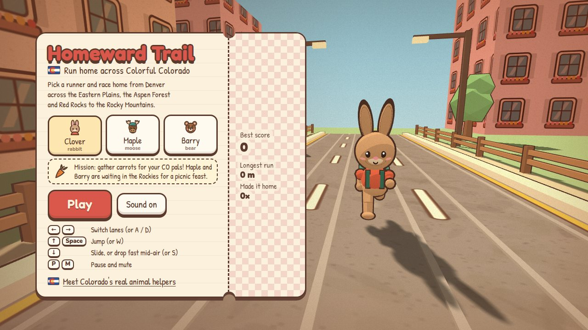
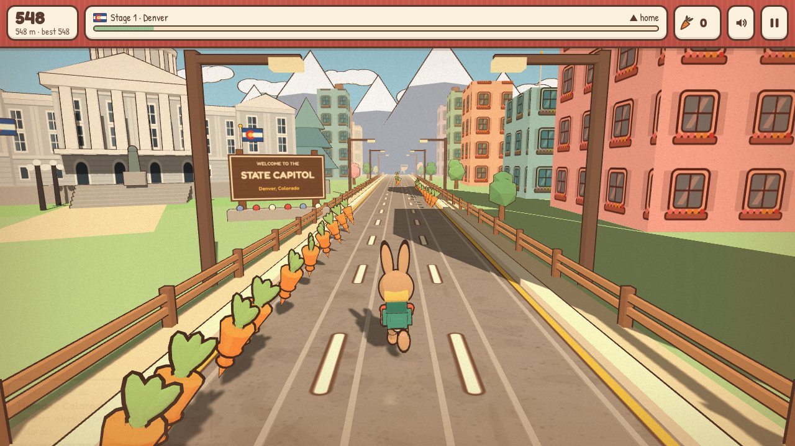
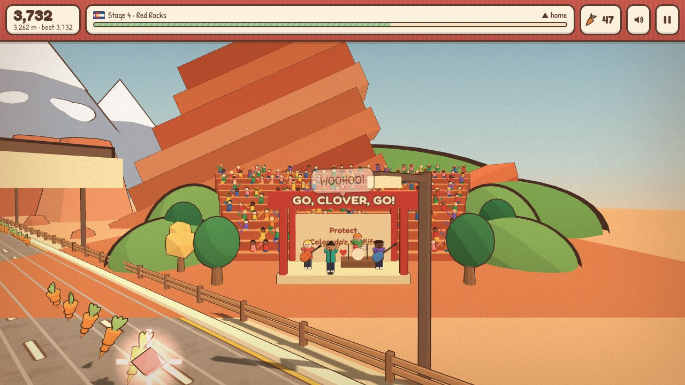
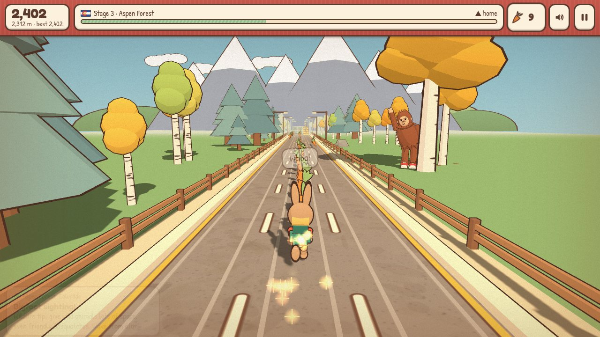
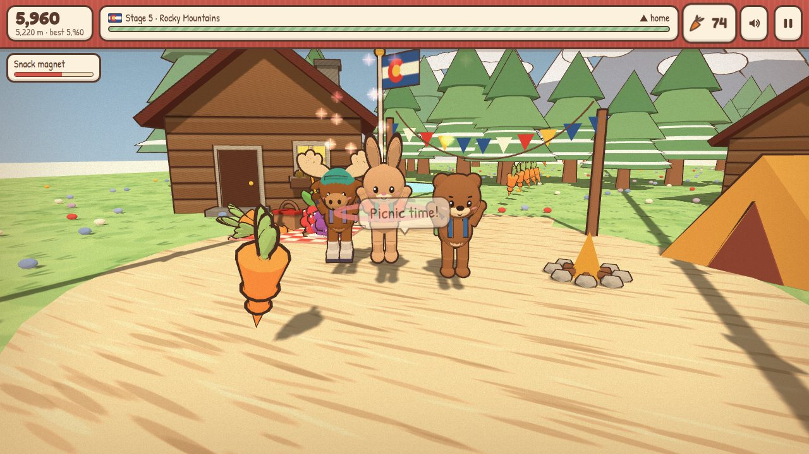
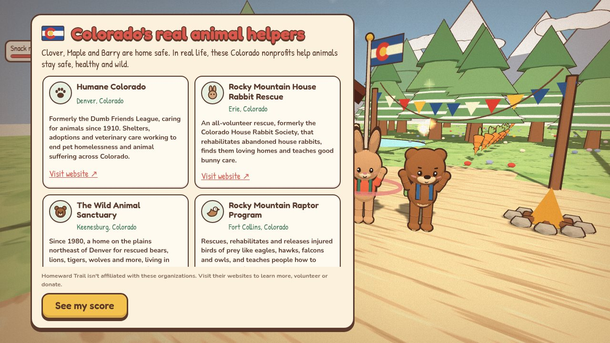

# 🏔️ Homeward Trail

**Run home across Colorful Colorado.**

Clover the rabbit, Maple the moose and Barry the bear have wandered a long way from home. Pick one and race 5,200 m from Denver across the Eastern Plains, the Aspen Forest and Red Rocks to a picnic in the Rocky Mountains, where the other two are waiting. Dodge parked and oncoming trains, hop barriers, slide under signs, and gather carrots, leaves or berries for the feast.

The game is built to inform as much as to entertain. Along the road you pass six real Colorado nonprofits that protect animals, each with its own highway exit sign and a short card about its work, and the run ends with a showcase that links to all of them.

**▶️ Play it:** https://namoos99.github.io/homeward-trail/

<p>
  
  
  
  
  
  
</p>

## What's on the trail

- **Five Colorado stages** that change right at their welcome signs: Denver (with the gold-domed State Capitol), the Eastern Plains, the Aspen Forest (where a shy Bigfoot in red sneakers peeks out from behind an aspen and waves), Red Rocks (a four-piece band plays and a packed amphitheatre cheers you by name) and the Rocky Mountains over Loveland Pass.
- **Three runners, three snacks:** Clover gathers carrots, Maple gathers leaves, Barry gathers berries. A sparkle gem pulls snacks toward you for a few seconds.
- **Fair difficulty:** the pace rises gently, and every obstacle pattern is built to leave an escape route (see [DECISIONS.md](DECISIONS.md)).
- **Everything is made in code:** the 3D models, textures, music, sound effects and the little cartoon voices are all generated at runtime. There are no image or audio files.
- **Saved progress:** best score, longest run and how many times you've made it home are kept in your browser.

## Controls

| | Keyboard | Touch |
|---|---|---|
| Switch lanes | ← → or A / D | Swipe left / right |
| Jump | ↑, W or Space | Swipe up |
| Slide (or drop fast mid-air) | ↓ or S | Swipe down |
| Pause / mute / restart | P or Esc / M / R | On-screen buttons |

## Colorado's real animal helpers

| Nonprofit | Where | What they do |
|---|---|---|
| [Humane Colorado](https://humanecolorado.org) | Denver | Shelters, adoptions and vet care to end pet homelessness and animal suffering |
| [Rocky Mountain House Rabbit Rescue](https://www.rmhrr.org) | Erie | All-volunteer rescue and rehoming of abandoned house rabbits |
| [The Wild Animal Sanctuary](https://www.wildanimalsanctuary.org) | Keenesburg | Lifelong natural habitats for rescued bears, big cats, wolves and more |
| [Rocky Mountain Raptor Program](https://www.rmrp.org) | Fort Collins | Rescue, rehabilitation and release of eagles, hawks, falcons and owls |
| [Greenwood Wildlife Rehabilitation Center](https://www.greenwoodwildlife.org) | Lyons & Longmont | Care for orphaned, injured and sick wildlife from 200+ species |
| [Rocky Mountain Wild](https://rockymountainwild.org) | Denver | Protecting wildlife habitat and planning safe crossings over I-70 |

Homeward Trail isn't affiliated with these organizations. Their names are used only to point players toward their work, and no logos are used.

## Run it locally

Open `index.html` in Chrome, Edge, Firefox or Safari. If your browser blocks local files, serve the folder instead:

```bash
python3 -m http.server 8000
# then open http://localhost:8000
```

three.js loads from a CDN, with a bundled copy in `vendor/` as a fallback, so the game still runs offline (the web fonts fall back to system fonts).

## Checks

`tests/check_game.py` plays the game headlessly with the network switched off. It confirms the page loads cleanly, lets a simple bot play full runs, checks that the scenic stretches around the landmarks stay free of obstacles, and checks that no scenery pops in or out while on screen.

```bash
pip install playwright && python -m playwright install chromium
python tests/check_game.py
```

## Project layout

```
index.html              the whole game: HTML, CSS and JavaScript in one file
vendor/three.min.js     three.js r128 (MIT), used if the CDN can't be reached
docs/screenshots/       images for this README
tests/check_game.py     headless checks
DECISIONS.md            the design and engineering choices behind the game
```

## Built with

[three.js](https://threejs.org) r128 for 3D, the Web Audio API for all music and sound, and Google Fonts (Fredoka, Patrick Hand, Nunito). The cozy, hand-drawn look takes inspiration from warm illustrated games and Colorado travel posters.
